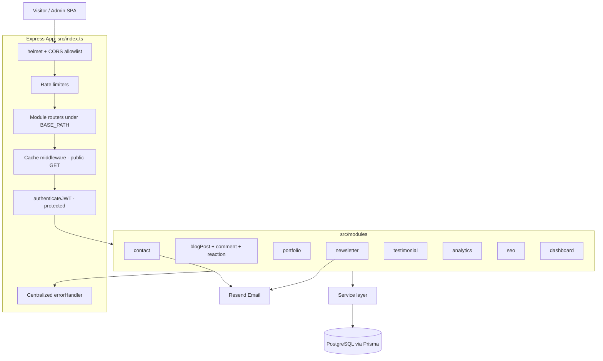
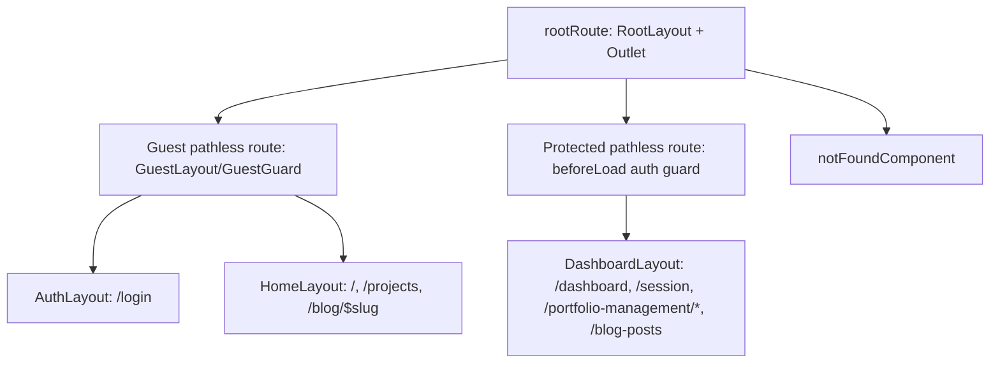

# Design Document

## Overview

This design upgrades the existing portfolio platform across its Express + TypeScript + Prisma backend and its React + Vite frontend. The work extends the current modular backend (auth, portfolio, blog, dashboard, image modules) with rich case-study content, blog engagement (comments, reactions, accurate view counting, categories/tags, related posts, reading time), visitor-facing features (contact form, newsletter, testimonials), an authenticated admin dashboard, analytics, and a set of cross-cutting technical improvements (rate limiting, security hardening, SEO, caching, consistent pagination, and expanded test coverage). It also renames the misspelled `src/cummon` directory to `src/common` and migrates the frontend router from `react-router-dom` to TanStack Router.

The design preserves the established conventions of the codebase:

- **Modular layout**: each feature lives under `src/modules/<feature>/` with `*.controller.ts`, `*.service.ts`, `*.routes.ts`, and `*.module.ts` files. The `*.module.ts` instantiates the service and injects it into the controller (manual dependency injection).
- **Controllers** wrap handlers in `asyncHandler`, parse input with Zod schemas from `src/common/zod`, and respond through the shared `response` helper (`{ status, message, data, metadata }`).
- **Services** own all Prisma access via the shared `db` client and throw the typed exceptions from `src/common/utils/catch-errors.ts`.
- **Routes** register Swagger JSDoc and apply `authenticateJWT` from the JWT strategy for protected endpoints.
- **Errors** flow through the centralized `errorHandler` middleware.

### Goals

- Add distinct problem/solution/results fields and public filtering/search to portfolios (Req 1, 2).
- Add blog categories, tags, comments with moderation, reactions, accurate session-based view counting, reading time, and related posts (Req 3, 4, 5, 5b, 6).
- Add contact, newsletter, and testimonial modules (Req 7, 8, 9).
- Provide authenticated admin CRUD and analytics (Req 10, 11).
- Harden the API with rate limiting, security headers, CORS, and Zod validation (Req 12).
- Provide SEO support (sitemap, dynamic meta/OG) and caching of public endpoints (Req 13, 14).
- Standardize pagination (Req 15) and expand test coverage (Req 16).
- Rename `src/cummon` to `src/common` (Req 17).
- Migrate the frontend router to TanStack Router (Req 18).

### Non-Goals

- No change to the authentication, 2FA, or email-verification flows beyond reusing them.
- No switch to a distributed cache; the cache layer is an in-process abstraction with a Redis-compatible interface for future extension.

## Architecture

### High-Level Backend Architecture



### Request Pipeline

The global middleware order in `src/index.ts` becomes:

1. `express.json` / `express.urlencoded` body parsing.
2. `helmet()` for security headers (Req 12.3).
3. `cors()` configured with an origin allowlist (Req 12.4).
4. `cookieParser`, `passport.initialize()`.
5. `morganMiddleware` request logging.
6. Per-router rate limiters applied at registration (Req 12.1, 12.2).
7. Cache middleware on public GET routes (Req 14).
8. `authenticateJWT` on protected routes (Req 10.3, 11.4).
9. Zod validation inside controllers (Req 12.5, 12.6).
10. `errorHandler` last, plus `notFound` for unmatched API routes.

### Cross-Cutting Components

| Component | Location | Responsibility | Requirements |
|-----------|----------|----------------|--------------|
| Pagination util | `src/common/utils/pagination.ts` | Parse/validate page & limit, build `Pagination_Metadata` | 15 |
| Rate limiters | `src/middlewares/rate-limit/index.ts` | `authLimiter`, `writeLimiter` via `express-rate-limit` | 12.1, 12.2 |
| Security config | `src/index.ts` + `src/config/security.config.ts` | helmet, CORS allowlist | 12.3, 12.4 |
| Validation middleware | `src/middlewares/validate/index.ts` | Optional `validate(schema)` wrapper + empty-body guard | 12.5, 12.6 |
| Cache layer | `src/common/cache/cache.ts` + `src/middlewares/cache/index.ts` | TTL store, cache middleware, tag-based invalidation | 14 |
| SEO service | `src/modules/seo/seo.service.ts` | Sitemap XML build/parse, meta/OG derivation | 13 |
| Analytics | `src/modules/analytics/` | Visit recording + summary aggregation | 11 |

### Module Inventory

New modules (each following the controller/service/routes/module convention):

- `src/modules/contact/`
- `src/modules/newsletter/`
- `src/modules/testimonial/`
- `src/modules/analytics/`
- `src/modules/seo/`
- `src/modules/blogComment/`
- `src/modules/blogReaction/`
- `src/modules/blogCategory/`
- `src/modules/blogTag/`

Extended modules:

- `src/modules/portfolio/` — public list/detail with filters, search, featured, pagination; problem/solution/results fields.
- `src/modules/blogPost/` — categories/tags relations, reading time, related posts, accurate view counting, reaction count in responses.
- `src/modules/dashboard/` — admin CRUD aggregation for portfolio and blog (Req 10).

## Components and Interfaces

### Pagination Utility (Req 15)

```ts
// src/common/utils/pagination.ts
export interface PaginationMetadata {
  total: number;
  page: number;
  limit: number;
  totalPages: number;
  hasNext: boolean;
  hasPrev: boolean;
}

export const PaginationQuerySchema = z.object({
  page: z.coerce.number().int().positive().default(1),
  limit: z.coerce.number().int().positive().default(10),
});

export function buildPaginationMetadata(
  total: number, page: number, limit: number
): PaginationMetadata;
```

- Defaults: page 1, limit 10 when omitted (Req 15.2).
- Non-positive-integer page/limit → Zod failure → 400 (Req 15.3, 2.8).
- Page beyond `totalPages` returns empty `data` with valid metadata, not an error (Req 15.4).

### Portfolio Module (Req 1, 2)

Public endpoints (no auth, cached):

- `GET /portfolio/public` — list published projects. Query: `page`, `limit`, `category` (slug), `tags` (CSV of slugs), `tech` (CSV of slugs), `search`, `featured`.
- `GET /portfolio/public/:slug` — published project detail by slug.

Service methods:

```ts
findPublic(params): { data: Portfolio[]; metadata: PaginationMetadata }
findPublishedBySlug(slug): PortfolioDetail | null
```

Behavior:

- `findPublic` always constrains `where.isPublished = true` (Req 2.5).
- Category filter matches `category.slug` (Req 2.1).
- Tag filters require ALL tags present (AND semantics via repeated `some` constraints) (Req 2.2).
- Tech filters require ALL techs present (Req 2.3).
- Search matches `title` OR `shortDesc`, `mode: 'insensitive'` (Req 2.4).
- `featured=true` constrains `featured = true` (Req 2.6).
- Every list response includes `Pagination_Metadata` (Req 2.7).
- `findPublishedBySlug` returns 404 when slug missing or `isPublished = false` (Req 1.4, 1.5); includes problem/solution/results, gallery (ordered by `position` asc), liveUrl, repoUrl, category, tags, tech stack with `name` + `icon` (Req 1.2, 1.3, 1.6).

### Blog Module (Req 3, 4, 5, 5b, 6)

Public endpoints (cached):

- `GET /blog-posts/public` — list published posts; filters `category` (slug), `tag` (slug), `search`, pagination (Req 3.4, 3.5, 3.6).
- `GET /blog-posts/public/:slug` — published post detail including category, tags, reaction count, view count, reading time, related posts (Req 5.2, 5b.3, 6.1, 6.2, 6.3).
- `GET /blog-posts/public/:slug/comments` — approved comments, newest first (Req 4.2).
- `POST /blog-posts/public/:slug/comments` — submit comment (rate-limited write) (Req 4.1).
- `POST /blog-posts/public/:slug/reactions` — add reaction (rate-limited write) (Req 5.1).

Admin endpoints (auth): category/tag assignment, comment moderation (approve/delete).

Key service logic:

- **Reading time** (`src/common/utils/reading-time.ts`): `max(1, ceil(wordCount / 200))` (Req 6.1).
- **Related posts**: up to 3 published posts sharing category or any tag, excluding the current post; fallback to most-recent published when the post has no category and no tags (Req 6.2, 6.3).
- **Comments**: created in unapproved state when moderation enabled; public reads return only approved (Req 4.7); body validation 1–2000 chars, whitespace-only allowed if under limit (Req 4.3, 4.4); email format validated (Req 4.5); admin delete returns success only after deletion resolves (Req 4.6).
- **Reactions**: insert reaction row then return updated count; 404 if post missing (Req 5.1, 5.3).
- **View counting**: see Data Models `BlogPostView`. A view increments `totalViews` at most once per `(postId, sessionId)` within 24h (Req 5b.1, 5b.2). A one-time migration resets all `totalViews` to 0 (Req 5b.4).

### Contact Module (Req 7)

- `POST /contact` (public, rate-limited write): validate name/email/subject/body via Zod; persist `ContactMessage`; attempt Resend notification to owner. Email failure is caught and logged; the request still returns success (Req 7.1, 7.2, 7.3). Validation failure → 400 and nothing persisted (Req 7.4).
- `GET /contact` (admin): list newest-first with pagination (Req 7.5).

### Newsletter Module (Req 8)

- `POST /newsletter/subscribe` (public): valid email → persist subscription with generated `unsubscribeToken` (Req 8.1). Duplicate email → success without duplicate, even when status lookup fails (treat lookup error as "already handled", idempotent) (Req 8.2). Invalid email → 400 (Req 8.3).
- `GET /newsletter/unsubscribe?token=...` (public): valid token marks subscription inactive and returns success (Req 8.4).

### Testimonial Module (Req 9)

- `POST /testimonial` (admin): create with authorName/authorRole/quote; missing field → 400 (Req 9.1, 9.4).
- `GET /testimonial/public` (public): only published testimonials (Req 9.2).
- `PATCH /testimonial/:id/publish` (admin): update published state, return updated record (Req 9.3).

### Admin Dashboard (Req 10)

The `dashboard` module aggregates admin CRUD over portfolio and blog. All endpoints require `authenticateJWT` → unauthenticated requests get 401 (Req 10.3).

- Portfolio CRUD + admin list (published and unpublished) with pagination (Req 10.1, 10.4).
- Blog CRUD + admin list (published and unpublished) with pagination (Req 10.2, 10.5).
- Publish toggle endpoints persist and return updated record (Req 10.6).

### Analytics Module (Req 11)

- `POST /analytics/visit` (public, lightweight): record `VisitEvent { path, createdAt }` (Req 11.1).
- `GET /analytics/summary` (admin): total visits, last-30-days visits, top 5 posts by `totalViews`, top 5 projects by view metric (Req 11.2); unauthenticated → 401 (Req 11.4).
- `GET /analytics/aggregations` (admin): project counts grouped by category, tag, and tech stack (Req 11.3).

### SEO Module (Req 13)

```ts
// src/modules/seo/seo.service.ts
buildSitemap(items: SitemapEntry[]): string          // XML string
parseSitemap(xml: string): string[]                  // list of <loc> URLs
buildMeta(item): { title; description; og: {...} }
```

- `GET /sitemap.xml` returns XML containing canonical URL of every published project and post (Req 13.1).
- Meta builder derives title/description/OG from a content item (Req 13.2). If `metaImage` defined, it is always the OG image (Req 13.3). If `metaDesc` absent, derive from `shortDesc`/`excerpt` (Req 13.4).
- Frontend uses `react-helmet-async` to inject per-page meta on published project/post pages.

### Cache Layer (Req 14)

```ts
// src/common/cache/cache.ts
interface CacheStore {
  get(key): { value: any; expiresAt: number } | undefined;
  set(key, value, ttlMs): void;
  delByTag(tag): void;     // tag-based invalidation
}
```

- Cache middleware keys on method + path + query for public GET routes; stores response for a bounded TTL not exceeding the configured max (Req 14.1).
- A valid cached entry is served without hitting the DB (Req 14.2).
- Services emit invalidation by tag (e.g., `portfolio`, `blog`) on create/update/delete so affected cached responses are cleared (Req 14.3).

### Rate Limiting & Security (Req 12)

- `authLimiter` applied to `/auth/*` (Req 12.1) and `writeLimiter` to public write endpoints (contact, newsletter, comments, reactions) (Req 12.2), both returning 429 on exceed via `express-rate-limit`.
- `helmet()` retained/expanded for security headers on every response (Req 12.3).
- CORS restricted to a configured allowlist parsed from env (Req 12.4).
- Zod validation in every write controller; empty-body guard returns 400 before processing (Req 12.5, 12.6).

### Common Folder Rename (Req 17)

`src/cummon` → `src/common`. All imports referencing `../../cummon/...` (and any alias) updated to `../../common/...`. The rename must leave the compiler with no module-resolution errors (Req 17.3) and the test suite passing as before (Req 17.4). This is a mechanical move handled with import-aware relocation.

### Frontend Router Migration (Req 18)

Migrate from `react-router-dom` (`createBrowserRouter`) to `@tanstack/react-router`.



Design points:

- Build the route tree with `createRootRoute` + `createRoute`, composed into `createRouter`. `main.tsx` swaps `RouterProvider` from `react-router-dom` to the TanStack one (Req 18.1).
- Preserve every existing path exactly so public and protected routes render at the same URLs (Req 18.2, 18.3) and direct deep-links resolve without redirect (Req 18.4).
- Protected routes use `beforeLoad` to check `useAuthStore` auth state; unauthenticated access redirects to `/login` (Req 18.5); authenticated renders the dashboard route (Req 18.6). Hydration gating from the current `ProtectedRoute` is preserved using the store's `hydrated` flag.
- A single `notFoundComponent` on the router renders the existing `NotFound` view for unmatched paths (Req 18.7).
- Remove `react-router-dom` from `package.json` and eliminate all its imports (Req 18.8); the Vite build resolves all routing imports cleanly (Req 18.9).
- TanStack Router integrates with the existing `@tanstack/react-query` provider; loaders may prefetch via the query client but data fetching remains in react-query hooks to minimize churn.

## Data Models

### Prisma Schema Changes

**Portfolio — new case-study fields (Req 1.1):**

```prisma
model Portfolio {
  // ...existing fields...
  problem  String? @db.Text
  solution String? @db.Text
  results  String? @db.Text
  // ...existing relations...
  views    PortfolioView[]
}
```

**Blog categories & tags (Req 3):**

```prisma
model BlogCategory {
  id        String     @id @default(uuid())
  name      String     @unique
  slug      String     @unique
  createdAt DateTime   @default(now())
  posts     BlogPost[]
}

model BlogTag {
  id    String              @id @default(uuid())
  name  String
  slug  String              @unique
  posts BlogTagOnBlogPost[]
}

model BlogTagOnBlogPost {
  blogPostId String   @db.Uuid
  tagId      String
  post       BlogPost @relation(fields: [blogPostId], references: [id], onDelete: Cascade)
  tag        BlogTag  @relation(fields: [tagId], references: [id], onDelete: Cascade)
  @@id([blogPostId, tagId])
}
```

**BlogPost — relations, reactions, views (Req 3, 4, 5, 5b):**

```prisma
model BlogPost {
  // ...existing fields...
  categoryId String?
  category   BlogCategory?       @relation(fields: [categoryId], references: [id])
  tags       BlogTagOnBlogPost[]
  comments   BlogComment[]
  reactions  BlogReaction[]
  views      BlogPostView[]
}

model BlogComment {
  id         String   @id @default(uuid())
  blogPostId String   @db.Uuid
  name       String
  email      String
  body       String   @db.Text
  isApproved Boolean  @default(false)
  createdAt  DateTime @default(now())
  post       BlogPost @relation(fields: [blogPostId], references: [id], onDelete: Cascade)
  @@index([blogPostId, isApproved, createdAt])
}

model BlogReaction {
  id         String   @id @default(uuid())
  blogPostId String   @db.Uuid
  type       String   @default("like")
  createdAt  DateTime @default(now())
  post       BlogPost @relation(fields: [blogPostId], references: [id], onDelete: Cascade)
  @@index([blogPostId])
}

model BlogPostView {
  id         String   @id @default(uuid())
  blogPostId String   @db.Uuid
  sessionId  String
  createdAt  DateTime @default(now())
  post       BlogPost @relation(fields: [blogPostId], references: [id], onDelete: Cascade)
  @@unique([blogPostId, sessionId])
  @@index([blogPostId, createdAt])
}
```

The `@@unique([blogPostId, sessionId])` enforces idempotent view counting; the service treats an existing row within 24h as "already counted" (Req 5b.1, 5b.2). When a row is older than 24h, the window has elapsed and a new count may be recorded (implementation refreshes the row timestamp and increments).

**Contact, Newsletter, Testimonial (Req 7, 8, 9):**

```prisma
model ContactMessage {
  id        String   @id @default(uuid())
  name      String
  email     String
  subject   String
  body      String   @db.Text
  createdAt DateTime @default(now())
  @@index([createdAt])
}

model NewsletterSubscription {
  id              String   @id @default(uuid())
  email           String   @unique
  isActive        Boolean  @default(true)
  unsubscribeToken String  @unique
  createdAt       DateTime @default(now())
}

model Testimonial {
  id          String   @id @default(uuid())
  authorName  String
  authorRole  String
  quote       String   @db.Text
  isPublished Boolean  @default(false)
  createdAt   DateTime @default(now())
}
```

**Analytics (Req 11):**

```prisma
model VisitEvent {
  id        String   @id @default(uuid())
  path      String
  createdAt DateTime @default(now())
  @@index([createdAt])
  @@index([path])
}

model PortfolioView {
  id          String    @id @default(uuid())
  portfolioId String
  sessionId   String
  createdAt   DateTime  @default(now())
  portfolio   Portfolio @relation(fields: [portfolioId], references: [id], onDelete: Cascade)
  @@unique([portfolioId, sessionId])
}
```

`PortfolioView` supports the "top 5 most-viewed projects" metric (Req 11.2). Project counts grouped by category/tag/tech (Req 11.3) are computed with Prisma `groupBy`/`count` over existing relation tables.

### DTOs / Zod Schemas

New schemas under `src/common/zod/`:

- `blog-comment.schema.ts` — `name` (non-empty), `email` (email), `body` (min 1, max 2000).
- `blog-reaction.schema.ts` — `type` (optional, default "like").
- `blog-category.schema.ts`, `blog-tag.schema.ts`.
- `contact.schema.ts` — `name`, `email` (email), `subject`, `body` all required.
- `newsletter.schema.ts` — `email` (email).
- `testimonial.schema.ts` — `authorName`, `authorRole`, `quote` required; `isPublished` optional.
- `pagination.schema.ts` — shared `page`/`limit` coercion + positivity.
- Public portfolio/blog list filter schemas (category, tags, tech, search, featured).

## Correctness Properties

*A property is a characteristic or behavior that should hold true across all valid executions of a system-essentially, a formal statement about what the system should do. Properties serve as the bridge between human-readable specifications and machine-verifiable correctness guarantees.*

These properties target the pure-logic and data-transformation parts of the backend (pagination math, reading time, sitemap serialization, filtering/search invariants, view-count idempotence, related-post selection, newsletter idempotence, cache behavior, aggregation correctness). Infrastructure concerns (rate limiting, helmet/CORS, the folder rename, and the frontend router migration) are validated through integration, smoke, and example tests described in the Testing Strategy.

### Property 1: Case-study fields round-trip

*For any* portfolio created with problem, solution, and results values, fetching that portfolio back returns the same problem, solution, and results values.

**Validates: Requirements 1.1**

### Property 2: Published project detail contains all required fields

*For any* published project with relations, fetching it by slug returns a response that includes its problem, solution, results, image gallery, demo link, repository link, category, tags, reaction-irrelevant metadata, and each tech stack entry's name and icon field.

**Validates: Requirements 1.2, 1.3**

### Property 3: Gallery is ordered by ascending position

*For any* project with image gallery entries, the gallery in the response is ordered non-decreasingly by the `position` value.

**Validates: Requirements 1.6**

### Property 4: Lookups never return unpublished projects

*For any* unpublished project, requesting it by slug returns a 404 and never exposes the unpublished content.

**Validates: Requirements 1.5**

### Property 5: Public project list returns only published items matching all active filters

*For any* set of projects and any combination of category, featured, and absent filters, every item in the public list response is published and satisfies every active filter; no unpublished item appears.

**Validates: Requirements 2.1, 2.5, 2.6**

### Property 6: Tag and tech filters use AND semantics

*For any* set of projects and any selection of tag slugs and tech slugs, every item in the public list response is associated with all requested tags and all requested tech entries.

**Validates: Requirements 2.2, 2.3**

### Property 7: Search returns exactly the case-insensitive matches

*For any* set of published projects and any search term, the public list response contains exactly those published projects whose title or short description contains the term, compared case-insensitively.

**Validates: Requirements 2.4**

### Property 8: Pagination metadata is correct and consistent

*For any* total count, page, and limit, the returned `Pagination_Metadata` contains total, page, limit, totalPages, hasNext, and hasPrev where `totalPages = ceil(total/limit)`, `hasNext = page < totalPages`, and `hasPrev = page > 1`; when page or limit is omitted, defaults of 1 and 10 are applied.

**Validates: Requirements 2.7, 15.1, 15.2**

### Property 9: Out-of-range page yields empty data, not an error

*For any* list request whose page exceeds totalPages, the response returns an empty data list together with valid `Pagination_Metadata` rather than an error.

**Validates: Requirements 15.4**

### Property 10: Invalid pagination input is rejected

*For any* page or limit value that is not a positive integer, the list endpoint responds with a 400 validation error.

**Validates: Requirements 2.8, 15.3**

### Property 11: Blog category and tag assignment round-trips

*For any* blog post, assigning a valid category and an arbitrary set of valid tags and then reading the post back returns that category and exactly that set of tags.

**Validates: Requirements 3.2, 3.3**

### Property 12: Public blog list returns only published items matching the filter

*For any* set of posts and any category-slug or tag-slug filter, every item in the public blog list response is published and matches the filter; a filter with no matches yields an empty list with valid metadata.

**Validates: Requirements 3.4, 3.5, 3.6**

### Property 13: Valid comments round-trip and start unapproved

*For any* valid comment (non-empty body up to 2000 characters, valid email), submitting it persists the comment associated with the post, returns the created comment, and the comment begins in an unapproved state.

**Validates: Requirements 4.1, 4.7**

### Property 14: Public comments are exactly the approved set, newest-first

*For any* post with a mix of approved and unapproved comments, the public comments response contains exactly the approved comments for that post, ordered by creation time in descending order.

**Validates: Requirements 4.2, 4.7**

### Property 15: Comment body length validation

*For any* comment body that is empty or exceeds 2000 characters, submission is rejected with a 400 validation error; and *for any* whitespace-only body whose length is between 1 and 2000 characters, submission is accepted.

**Validates: Requirements 4.3, 4.4**

### Property 16: Invalid email is rejected

*For any* malformed email value submitted to a comment or newsletter endpoint, the service responds with a 400 validation error.

**Validates: Requirements 4.5, 8.3**

### Property 17: Reaction count increases by the number of reactions submitted

*For any* published post and any number N of reactions submitted, the post's reaction count increases by exactly N and the returned count equals the stored count.

**Validates: Requirements 5.1, 5.2**

### Property 18: View counting is idempotent within the 24-hour window

*For any* published post and any single visitor session, any number of repeated views within a 24-hour window increment the post's view count by exactly one.

**Validates: Requirements 5b.1, 5b.2, 5b.3**

### Property 19: Reading time formula

*For any* post content, the computed reading time equals `max(1, ceil(wordCount / 200))`.

**Validates: Requirements 6.1**

### Property 20: Related posts selection is bounded, self-excluding, and relevant

*For any* published post that has a category or tags, the related posts are at most 3 published posts, never include the requested post, and each shares the post's category or at least one of its tags; *for any* published post with no category and no tags, the related posts are the most recent published posts excluding the requested post.

**Validates: Requirements 6.2, 6.3**

### Property 21: Contact submission round-trips and validates

*For any* valid contact message, submission persists the message and returns success; *for any* contact payload with a missing required field or invalid email, the service responds with 400 and persists nothing.

**Validates: Requirements 7.1, 7.4**

### Property 22: Admin contact list is newest-first with metadata

*For any* set of persisted contact messages, the admin list response is ordered by creation time descending and includes valid `Pagination_Metadata`.

**Validates: Requirements 7.5**

### Property 23: Newsletter subscription is idempotent

*For any* valid email subscribed any number of times, exactly one active subscription exists and every submission returns success, including when the existing-subscription lookup fails.

**Validates: Requirements 8.1, 8.2**

### Property 24: Newsletter unsubscribe round-trip

*For any* subscription, unsubscribing with its valid token marks the subscription inactive and returns success.

**Validates: Requirements 8.4**

### Property 25: Testimonial create round-trip and validation

*For any* testimonial with author name, author role, and quote, creation persists and returns the record; *for any* testimonial payload missing a required field, the service responds with 400.

**Validates: Requirements 9.1, 9.4**

### Property 26: Public testimonials are only published ones

*For any* set of testimonials, the public testimonial list contains only published testimonials.

**Validates: Requirements 9.2**

### Property 27: Published-state toggle round-trips

*For any* testimonial, project, or post, updating its published state persists the new state and the subsequent read returns that state.

**Validates: Requirements 9.3, 10.6**

### Property 28: Protected admin endpoints reject unauthenticated requests

*For any* admin management or analytics endpoint, a request without valid authentication receives a 401 response.

**Validates: Requirements 10.3, 11.4**

### Property 29: Admin lists include both published and unpublished items

*For any* set of projects or posts containing both published and unpublished items, the admin list response includes items of both states together with valid `Pagination_Metadata`.

**Validates: Requirements 10.4, 10.5**

### Property 30: Visit events round-trip

*For any* tracked path, recording a visit and then querying produces a visit event carrying that path and a timestamp.

**Validates: Requirements 11.1**

### Property 31: Analytics aggregations match naive recomputation

*For any* set of projects with category, tag, and tech relations, the aggregated counts grouped by category, tag, and tech equal the counts obtained by naively recomputing over the same data; and the analytics summary's top-5 lists are sorted by view count descending with length at most 5.

**Validates: Requirements 11.2, 11.3**

### Property 32: Invalid request bodies are rejected before processing

*For any* write endpoint and any body that violates its Zod schema (including an entirely absent body), the backend responds with a 400 validation error and performs no persistence side effect.

**Validates: Requirements 12.5, 12.6**

### Property 33: Sitemap completeness and round-trip

*For any* set of published and unpublished projects and posts, the set of `<loc>` URLs in the generated sitemap equals the set of canonical URLs of the published items; and *for any* set of canonical URLs, parsing the sitemap built from them yields the same set of URLs.

**Validates: Requirements 13.1, 16.3**

### Property 34: Meta and Open Graph derivation

*For any* content item, the meta builder produces a title, a meta description, and Open Graph tags; when the item defines a meta image, the Open Graph image equals that meta image; when the item has no meta description, the meta description is derived from the item's short description or excerpt.

**Validates: Requirements 13.2, 13.3, 13.4**

### Property 35: Cache TTL is bounded and serves without the database

*For any* cached public response, the entry's effective time-to-live never exceeds the configured maximum, and while the entry is valid it is served without querying the database.

**Validates: Requirements 14.1, 14.2**

### Property 36: Cache invalidation by tag

*For any* set of cached entries with assigned tags, invalidating a tag removes exactly the entries carrying that tag and leaves entries without that tag intact.

**Validates: Requirements 14.3**

## Error Handling

All errors propagate through the existing centralized `errorHandler` middleware. Modules throw the typed exceptions in `src/common/utils/catch-errors.ts`:

| Condition | Exception | Status | Requirements |
|-----------|-----------|--------|--------------|
| Unknown/unpublished slug | `NotFoundException` | 404 | 1.4, 1.5 |
| Reaction to missing post | `NotFoundException` | 404 | 5.3 |
| Zod validation failure (body or query) | Zod error → 400 in handler | 400 | 2.8, 3.7, 4.3, 4.5, 7.4, 9.4, 12.5, 12.6, 15.3 |
| Assigning nonexistent category | `BadRequestException` | 400 | 3.7 |
| Missing/invalid auth | `UnauthorizedException` (via `authenticateJWT`) | 401 | 10.3, 11.4 |
| Rate limit exceeded | `express-rate-limit` handler | 429 | 12.1, 12.2 |
| Unexpected service failure | `InternalServerException` | 500 | — |

Specific resilience rules:

- **Contact email failure (Req 7.3)**: the Resend call is wrapped in try/catch inside the service. A failure is logged via Winston and swallowed so the message stays persisted and the response remains success.
- **Newsletter idempotency (Req 8.2)**: the subscribe path treats unique-constraint violations and lookup failures as "already subscribed" and returns success without creating a duplicate.
- **Zod parsing**: controllers call `Schema.parse(...)`; the central error handler maps `ZodError` to a 400 response with field details. A dedicated empty-body guard ensures a missing body on write endpoints is reported as 400 rather than a downstream null error.
- **Validation precedes side effects**: input is parsed at the top of each write handler before any Prisma mutation, guaranteeing no persistence on invalid input (Req 7.4, 12.5).

## Testing Strategy

The project uses **Jest + ts-jest + supertest**. For property-based testing the design adds **fast-check** (the standard PBT library for the TypeScript/Jest ecosystem) as a dev dependency; properties are NOT implemented from scratch.

### Dual Approach

- **Unit / example tests**: specific scenarios, error cases, and integration points — 404 paths (Req 1.4, 5.3), nonexistent-category assignment (Req 3.7), comment deletion sequencing (Req 4.6), contact email-failure resilience (Req 7.3), and the admin CRUD happy paths (Req 10.1, 10.2).
- **Integration tests**: rate-limiter 429 behavior (Req 12.1, 12.2) and the contact notification email call against a mocked Resend client (Req 7.2), using 1–3 representative requests.
- **Smoke tests**: helmet header presence (Req 12.3), CORS allowlist enforcement (Req 12.4), the view-count reset migration (Req 5b.4), the `src/common` rename checks (Req 17.1–17.4), and the TanStack Router build/import checks (Req 18.8, 18.9).
- **Property tests**: the 36 properties above, each as a single property-based test.

### Property Test Configuration

- Each property is implemented as a **single** fast-check property test running a **minimum of 100 iterations** (`{ numRuns: 100 }` or higher).
- Pure functions (reading time, pagination metadata, sitemap build/parse, meta derivation, cache store) are tested directly. Service-level properties run against an in-memory/mocked Prisma layer (or a test database) and mock Resend so 100+ iterations stay cheap.
- Each property test is tagged with a comment referencing its design property:
  - Tag format: **Feature: portfolio-upgrade, Property {number}: {property_text}**
- Generators must exercise edge cases called out in the prework: whitespace-only and boundary-length comment bodies (Req 4.3, 4.4), non-ASCII content for reading time and search, empty filter results (Req 3.6), out-of-range pages (Req 15.4), and malformed emails (Req 4.5, 8.3).

### Frontend Testing (Req 18)

Router migration is validated with example-based tests (e.g., Vitest + Testing Library or the existing test setup): each public and protected path renders the expected component at the same URL (Req 18.2, 18.3, 18.4), unauthenticated access to a protected route redirects to `/login` (Req 18.5), authenticated access renders (Req 18.6), and an unknown path renders the not-found view (Req 18.7). A static check (grep + `package.json` inspection) confirms no `react-router-dom` references remain (Req 18.8), and the Vite build verifies clean routing imports (Req 18.9).

### Coverage Targets (Req 16)

The suite must cover success and validation-error paths for contact, newsletter, testimonial, blog comment, blog reaction, and portfolio filtering endpoints (Req 16.1), run to completion with passing results (Req 16.2), and include the sitemap round-trip property (Req 16.3, Property 33).
